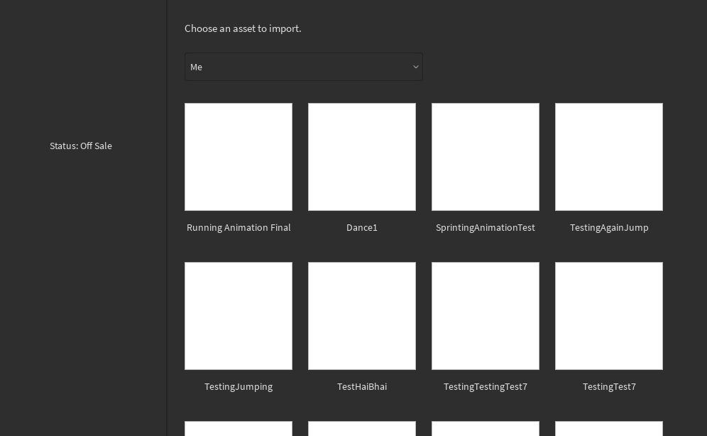

# 🎮 Importing Mixamo Animations into Roblox Studio

Bring your Roblox characters to life with high-quality Mixamo animations! This guide walks you through the process of importing and retargeting Mixamo animations for use in Roblox Studio, ensuring smooth and realistic character movements.

---

## 🧰 Prerequisites

Before you begin, ensure you have the following installed:

- [Roblox Studio](https://www.roblox.com/create)
- [Blender rig exporter/animation importer](https://www.roblox.com/library/716953901/Blender-rig-exporter-animation-importer)
- [Blender(2.79) Direct Link](https://download.blender.org/release/Blender2.79/blender-2.79b-windows64.zip)
- [Mixamo Account](https://www.mixamo.com/)
- [Roblox Blender Add-on Rig Exporter Plugin](https://pastebin.com/raw/fKtXPwKx)
- [Roblox Character for Mixamo](https://devforum-uploads.s3.dualstack.us-east-2.amazonaws.com/uploads/original/3X/b/d/bd22d7f9be43ef5800a6f670bd2118ddf6187ff7.fbx)

---

## 🔄 Steps Required
1. **Upload to Mixamo**: Import the rig into Mixamo, which I shared above (Roblox Blender Add-on Rig Exporter Plugin)
2. **Download Animated Rig**: Export the animated rig from Mixamo and ensure the settings are similar to this
3. **Install Blender Add-ons**: Install the addons(Roblox Blender Add-on Rig Exporter Plugin) from above in the blender **2.79b**
   - Use shortcut CTR+ALT+U and go to the Add -ons section from the top ribbon
     
   - Click on the Install Add-ons from file from the bottom left corner
     
   - Locate the Add-on file on your computer
     
   - Go to the user section from the left options, you will see the installed Add-on file, enable it
     
   - Now go to the Animation tab from the left of the panel in Blende,r you will see Rbx Animations, then import **obj** file character [Download this](https://github.com/nitingit7/MixamoToRobloxStudio/blob/1af366c7da4dbdd31b3f3f8a07838458b3e8d901/BaseModel.obj)
     
     
   - Click on the **Rebuild Rig** from the left under the Rbx Animation, then press ok(Make sure y coordinate is selected)
     
   - Now select LockRot from the bottom left
    
   - Now import Animation under the Rbx Animation, you and select the **fbx** file from your computer, then you will see
     
   - Make the changes to the  UI of Blender by adding more space/panel for **Dropsheet** and **Graph Editor**
     
   - You will see this
     
   - Select all the keyframes from **Dropsheet** like this
     
   - Then on the **Graph Editor** hit the space bar, a search will open, then search for **smooth key**
     
   - Then click on **Apply Armature**
     
   - Then click on **Export Animation**, a code will be copied to your clip-baord
     
---
4. **Open Roblox Studion**: open it and follow this steps below
   - Import a R15 rig to your workspace and anchor it and use Blender rig Exporter, which I provided at [Prerequisites](#-prerequisites)(Install this plugin in Roblox Studio)
     
   - Use the copied text from the **export animation** from the Blender and paste it here
     
   - After successfully pasting, go to the **Upload Animation to Roblox**
     
   - Now, delete that R15 rig and import a fresh new R15 rig and open animation window from Avatar
     
   - Select the R15 rig and import animation from Roblox
     
   - Then I hope the animation will play as expected, if any problem you are facing please feel free to ask :blush:
     
---  

## 📺 Video Tutorial

For a visual walkthrough, check out this comprehensive tutorial:

[

---

## 🧩 Resources

- [Roblox Developer Forum: Blender rig exporter](https://devforum.roblox.com/t/blender-rig-exporteranimation-importer/34729)
- [Roblox Developer Forum: XAXA Script and Tutorials](https://devforum.roblox.com/t/blender-rig-exporteranimation-importer/34729/214)

---

## 🤝 Contributing

Contributions are welcome! If you have suggestions or improvements, feel free to open an issue or submit a pull request.

---

## 📄 License

This project is licensed under the MIT License. See the [LICENSE](LICENSE) file for details.

---

By following this guide, you can seamlessly integrate Mixamo animations into your Roblox projects, enhancing the visual appeal and interactivity of your games. Happy animating!
